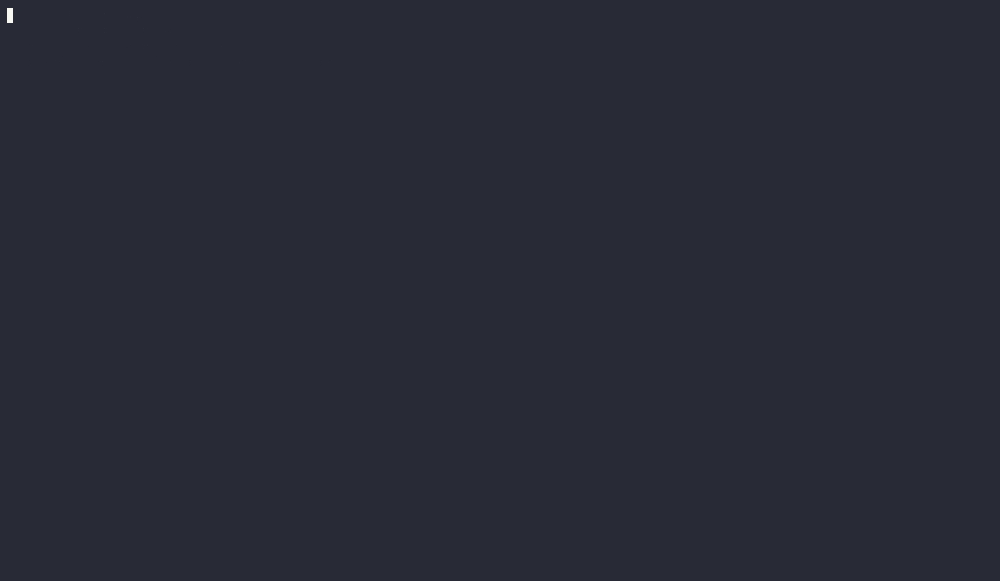

# unravel-sbom

**Generate accurate, standards-compliant Software Bills of Materials from your local development projects — in seconds.**

`unravel-sbom` is an open-source Python CLI tool that recursively scans multi-ecosystem development projects and produces valid SBOMs in **[SPDX v2.3](https://spdx.github.io/spdx-spec/v2.3/)** and **[CycloneDX 1.6](https://cyclonedx.org/docs/1.6/)** JSON format. It covers **npm**, **PyPI**, **Conan**, **CMake**, **ROS/ROS2**, and **Makefile**-based C/C++ projects — and pushes results directly to **[Dependency-Track](https://dependencytrack.org/)** in a single command.

> ⭐ If `unravel-sbom` helps you, please consider [starring the repo](https://github.com/daneb255/unravel-sbom/stargazers) to support the project!

---

## Why unravel-sbom?

Supply-chain security is no longer optional. Regulations like the US Executive Order 14028, the EU Cyber Resilience Act, and frameworks such as SLSA and NTIA all require a software bill of materials. Existing SBOM tools are often language-specific, heavyweight, or produce output that fails validation.

`unravel-sbom` was built around three principles:

1. **Correctness first.** Every output field maps directly to the SPDX 2.3 and CycloneDX 1.6 specifications. PURLs are generated via the official `packageurl-python` library.
2. **Resilience over rigidity.** A single malformed `package.json` should never abort a scan of thousands of files. Each parser is isolated — errors are collected and reported, not thrown.
3. **Zero heavy dependencies.** No Docker daemon, no language runtimes beyond Python 3.10.

---

## Supported Ecosystems

| Ecosystem | Files Scanned | Notes |
| --------- | ------------ | ----- |
| **npm / Node.js** | `package.json`, `package-lock.json` | Lock file (v1/v2/v3) preferred for exact versions |
| **PyPI / Python** | `requirements.txt`, `pyproject.toml`, `poetry.lock` | PEP-621, Hatch, Flit, and Poetry formats |
| **Conan / C++** | `conanfile.txt`, `conanfile.py` | AST-based parsing of `.py` files |
| **CMake / C++** | `CMakeLists.txt` | `find_package`, `FetchContent`, `ExternalProject`, `CPM_AddPackage` |
| **ROS / ROS2** | `package.xml`, `CMakeLists.txt` | REP-149 format 3; ament variable expansion |
| **Makefile / C** | `Makefile`, `Makefile.am`, `Makefile.in`, `Makefile.yocto` | `-l` flags, `pkg-config`, `git clone` (Yocto-style) |

---

## Shift Left with pkggate

Generating an SBOM tells you what is already in your project. Preventing vulnerable packages from entering in the first place is the next layer of defence.

**[pkggate](https://github.com/daneb255/pkggate)** is an open-source package firewall that blocks packages with known CVEs at install time, before a dependency ever lands in your codebase.

| Layer | Tool | When it acts |
| --- | --- | --- |
| **Prevent** — block vulnerable packages at install time | [pkggate](https://github.com/daneb255/pkggate) | Developer workstation & CI install step |
| **Detect** — inventory what is in the project | `unravel-sbom` | After install, on every build or release |
| **Monitor** — continuous vulnerability tracking | Dependency-Track | Ongoing, fed by `unravel-sbom` uploads |

---

## Key Features

- Recursive multi-ecosystem scanning with **live progress bar** and **elapsed time**
- **SPDX 2.3** and **CycloneDX 1.6** JSON output — write both in one pass with `--format both`
- **Native Dependency-Track upload** via `PUT /api/v1/bom` with async token polling
- **Package URL (PURL)** per component — compatible with OSV, Grype, and Dependency-Track
- **Automatic deduplication** — identical `(name, ecosystem, version)` entries merged
- **Lock-file priority** — resolved versions from lock files take precedence over range specifiers
- **119 unit tests** — covering every scanner, reporter, walker, and upload client

---

## Inspired by unblob

The recursive scanning and error-isolation strategy is directly inspired by **[unblob](https://github.com/onekey-sec/unblob)**, the open-source firmware extraction tool by [ONEKEY](https://onekey.com). The walker descends into every subdirectory, each scanner wraps its parser in a `safe_scan()` boundary, and failures are logged and collected — never thrown.
